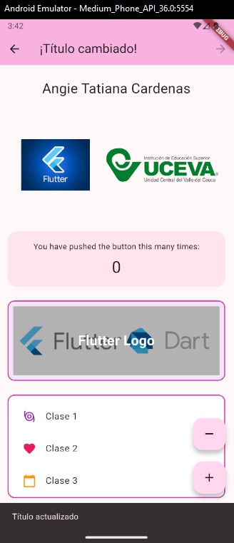
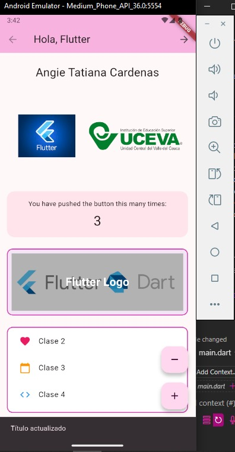

# Taller Flutter: Widgets y Estado

## Descripción
Este taller muestra el uso de widgets básicos y manejo de estado en Flutter. Incluye:
- AppBar con título dinámico usando setState().
- SnackBar al cambiar el título.
- Contador con botones flotantes.
- Dos imágenes (de red y local) debajo del nombre.
- Stack con texto sobre imagen.
- ListView con 4 elementos (icono y texto).

## Pasos para ejecutar
1. Clona el repositorio o descarga el proyecto.
2. Abre la carpeta en VS Code o tu editor favorito.
3. Ejecuta en terminal:
	```
	flutter pub get
	flutter run
	```
4. Asegúrate de tener la imagen local en `assets/images/logo.png` y la ruta registrada en `pubspec.yaml`.

## Funcionamiento
- Estado inicial: El AppBar muestra "Hola, Flutter".
- Al presionar el botón "Siguiente" en el AppBar, el título cambia a "¡Título cambiado!" y aparece un SnackBar con el mensaje "Título actualizado".
- Los widgets adicionales (Stack y ListView) se muestran en la pantalla.

## Capturas

### Estado inicial de la app


### Estado tras presionar el botón (título cambiado + SnackBar)


### Funcionamiento de los widgets adicionales


## Datos del estudiante
- Nombre completo: Angie Tatiana Cardenas
- Código: [230221007]
# taller1

## Enlaces de Pull Requests

- PR `feature/taller1 → dev`: [Ver aquí](https://github.com/AngieC23/curso-moviles-flutter/pull/1)
- PR `dev → main`: [Ver aquí](https://github.com/AngieC23/curso-moviles-flutter/pull/2)

A new Flutter project.

## Getting Started

This project is a starting point for a Flutter application.

A few resources to get you started if this is your first Flutter project:

- [Lab: Write your first Flutter app](https://docs.flutter.dev/get-started/codelab)
- [Cookbook: Useful Flutter samples](https://docs.flutter.dev/cookbook)

For help getting started with Flutter development, view the
[online documentation](https://docs.flutter.dev/), which offers tutorials,
samples, guidance on mobile development, and a full API reference.

## Arquitectura y Navegación

La app usa `go_router` para la navegación entre pantallas:
- `/` : HomeScreen (dashboard principal)
- `/paso_parametros` : PasoParametrosScreen (envío de parámetros y navegación go/push/replace)
- `/detalle/:parametro/:metodo` : DetalleScreen (muestra el parámetro y método de navegación)
- `/ciclo_vida` : CicloVidaScreen (demostración del ciclo de vida de StatefulWidget)
- `/widgets_demo` : WidgetsDemoScreen (ejemplo de GridView, TabBar y ListView)

Los parámetros se envían en la URL y se reciben en la pantalla destino usando `state.pathParameters`.

## Widgets usados y razón

- **GridView**: Para mostrar elementos en formato de cuadrícula, útil para dashboards y galerías.
- **TabBar + TabBarView**: Para organizar contenido en secciones navegables dentro de una misma pantalla.
- **ListView**: Para mostrar listas verticales de elementos.
- **CustomDrawer**: Menú lateral para navegación rápida entre pantallas.
- **Botones con SnackBar**: Para acciones secundarias y feedback al usuario.
- **Imágenes (network y asset)**: Para enriquecer visualmente la interfaz.
